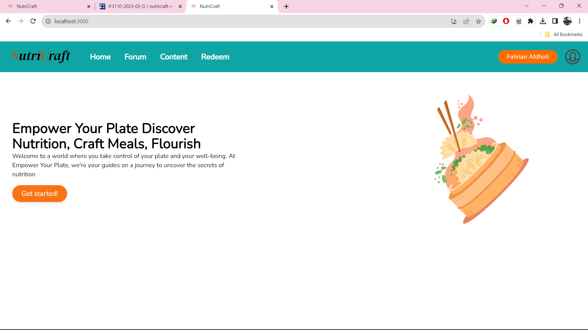
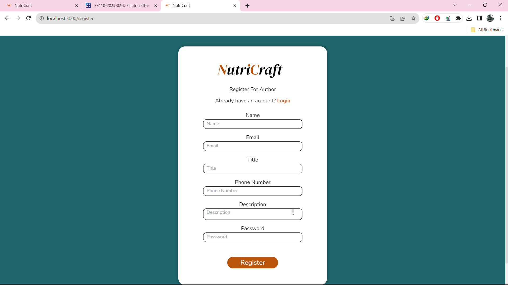
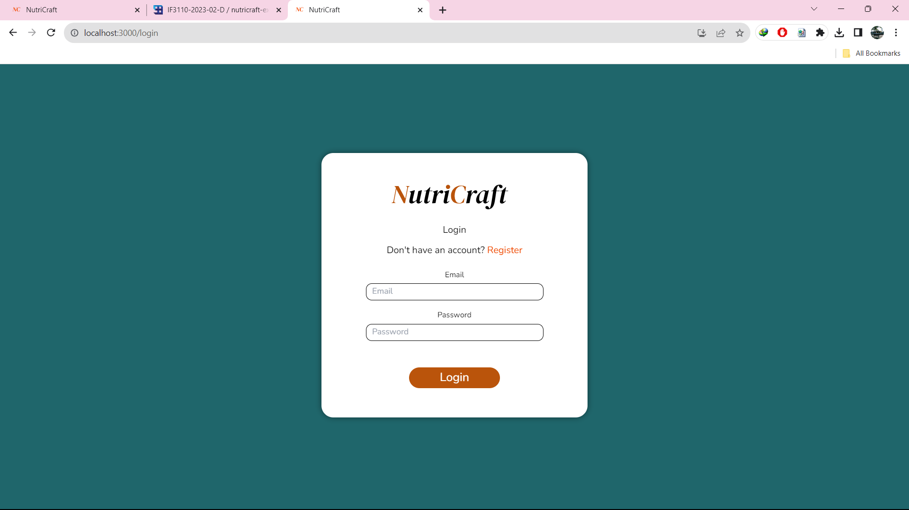
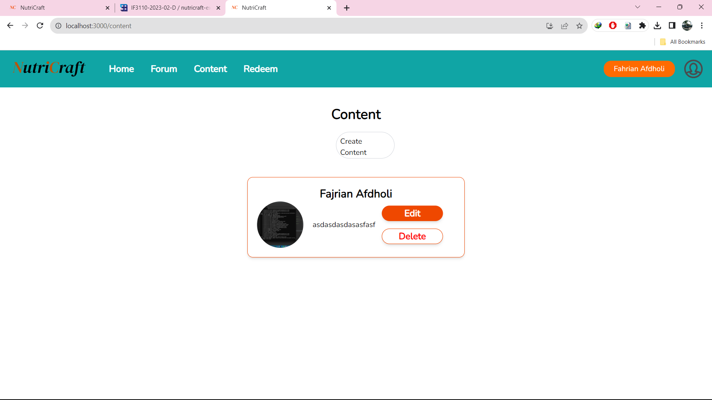
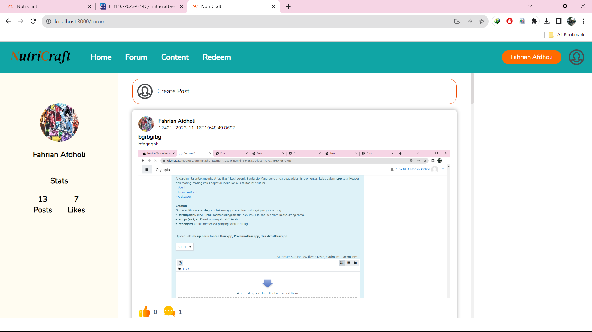
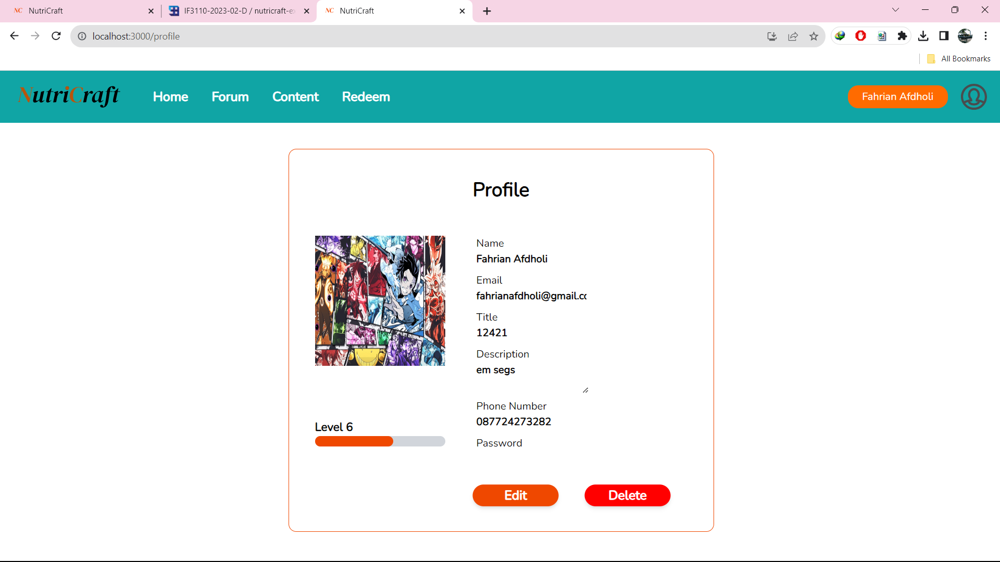
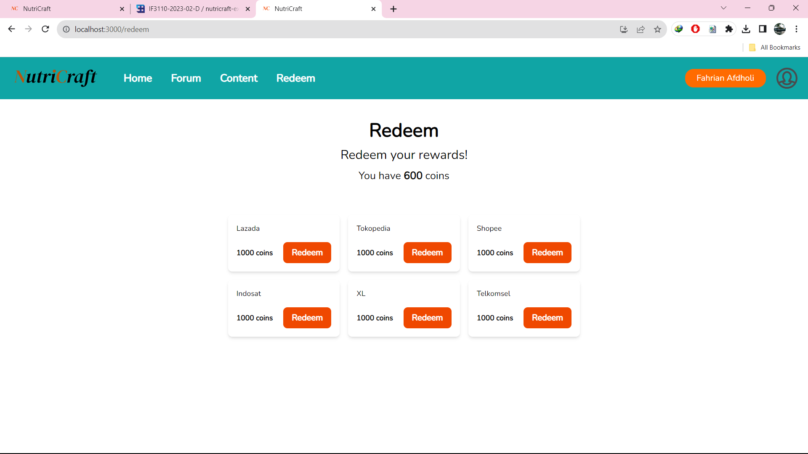

## Overview
nutricraft-spa adalah frontend dari aplikasi Nutricraft yang digunakan untuk membuat konten, dan berdiskusi di forum bagi para creator, aplikasi ini juga terdapat fitur redeem yang digunakan untuk menukarkan poin yang dapat ditukar dengan berbagai macam hadiah. Aplikasi ini dibuat menggunakan React+Typescript+Tailwind.

## Pages

1. Home
    
     
    
    
2. Register
    
     
    
    
3. Login
    
     
    
    
4. Content
    
     
    
    
5. Forum
    
     
    
    
6. Profile
    
     
    
    
7. Redeem
    
     
    
    

## Pembagian Tugas

| Page           | NIM                          |
|----------------|------------------------------|
| Login          | 13521005, 13521031           |
| Register       | 13521005, 13521031           |
| Content        | 13521005, 13521031, 13521011 |
| Forum          | 13521005, 13521031, 13521011 |
| Redeem         | 13521005, 13521031           |
| Home           | 13521005                     |
| Profile        | 13521005, 13521031, 13521011 |
